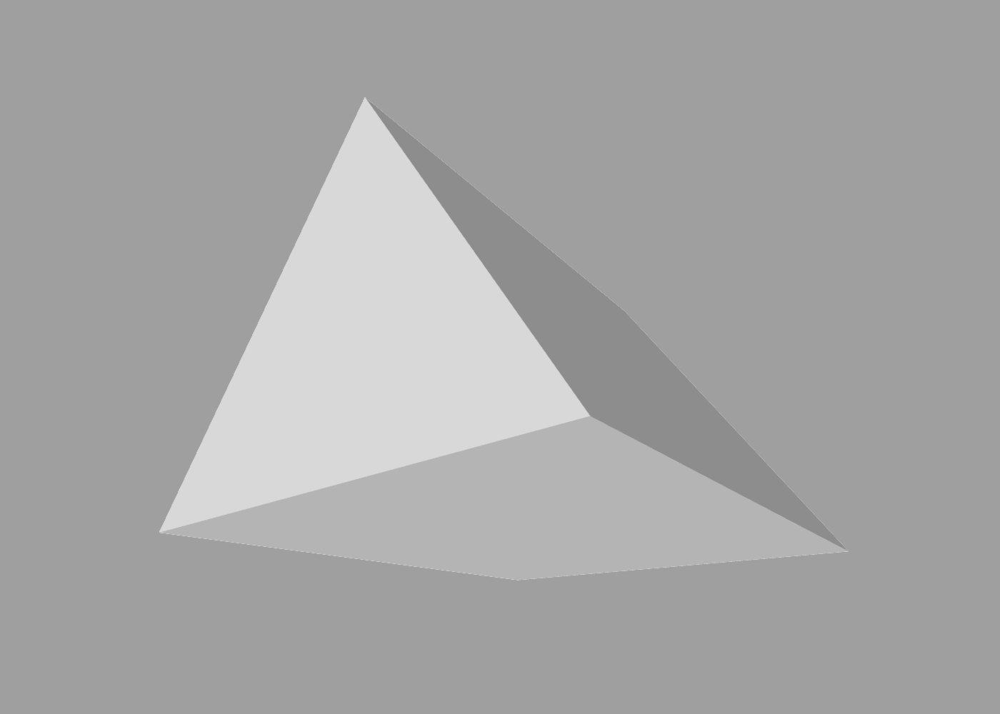
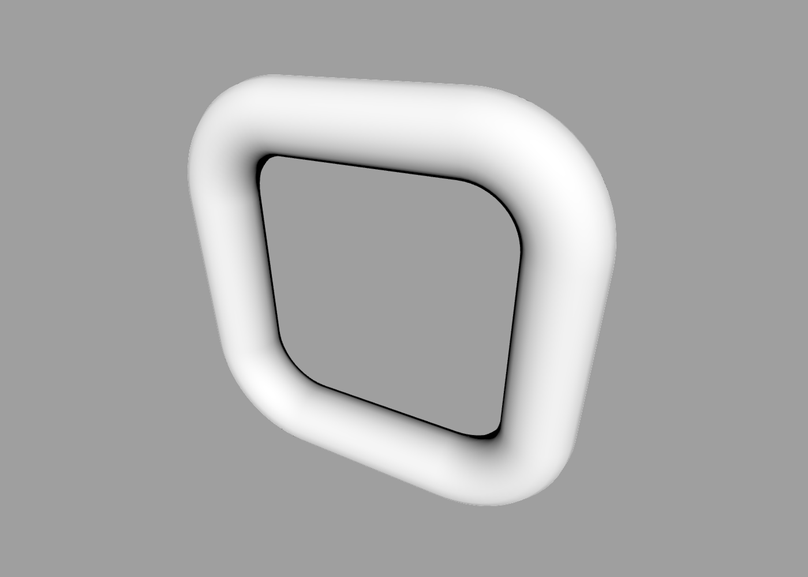
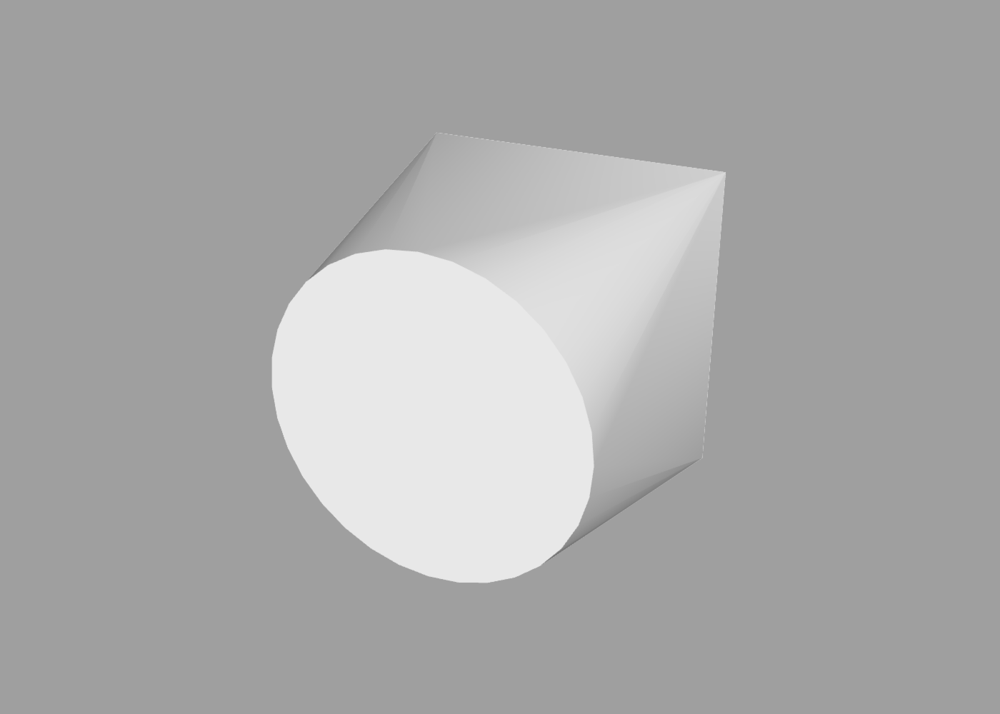

Builders
---

We explored some basic 3D shape types in the [primitives](primitives.md) section, but the real power of ShapeScript comes from the ability to define custom shapes.

In the [paths](paths.md) section we looked at how to define custom shapes using paths. ShapeScript has a variety of built-in commands for creating 3D shapes from paths, called *builders*:

## Fill

The most basic shape builder is the `fill` command, which creates a filled polygon from a path. Using the pentagon path we defined earlier, we can use `fill` to create a solid pentagon:

```
fill path {
    for 0 to 5 {
        point 0 1
        rotate 2 / 5
    }   
}
```


Unlike a path, a filled shape can have a color and texture, but it has zero thickness.

If a path contains multiple overlapping sub-paths, they will be filled using the [even-odd rule](https://en.wikipedia.org/wiki/Even–odd_rule). For example, the [overlapping circles](paths.md#nested-paths) path would be filled like this:

```swift
fill path {
    circle
    translate 0.5
    scale 0.5
    circle
}
```


## Lathe

The `lathe` command creates a 3D shape from a 2D path by revolving it around the Y axis.

To use `lathe`, you must first define a suitable path. For example, the following code defines the *profile* (one half of the outline) of a chess piece:

```swift
path {
    curve 0 0.78
    curve -0.15 0.7
    curve -0.15 0.5
    point -0.07 0.45
    curve -0.12 0.2
    point -0.25 0.1
    point -0.25 0
    point 0 0
}
```


When passed to the `lathe` command, the path creates a solid 3D model:

```swift
lathe path {
    curve 0 0.78
    curve -0.15 0.7
    curve -0.15 0.5
    point -0.07 0.45
    curve -0.12 0.2
    point -0.25 0.1
    point -0.25 0
    point 0 0
}
```


As with other curved shapes such as the `sphere` and `cone`, the smoothness of the lathed surface can be controlled using the `detail` and `smoothing` commands.

The path describing the profile of the lathed shape was in this case open-ended. Since the ends meet at the Y axis anyway, the resultant shape will still be closed. Open paths that do not touch the axis will produce a hollow shape with visible holes.

Lathed paths must lie flat on the XY plane, and  be positioned entirely to one side of the Y axis. Any points on the path with a non-zero Z coordinate will be flattened, and parts of the path that cross the Y axis will be clipped before lathing.

## Extrude

The `extrude` command extrudes a 2D path along the Z axis. The path therefore represents a cross-section of the final shape. The default extrusion distance is 1 unit, but it can be overridden using the `size` option or relative `scale` command (as described in [transforms](transforms.md)).

In the following example, `extrude` is used to create a triangular prism:

```swift
extrude {
    size 1 1 2 // increase extrusion distance to 2 units
    path {
        for 0 to 3 {
            point 0 1
            rotate 2 / 3
        }
    }
}
```



You can also extrude a shape *along* another path using the `along` option. In the following example, a circle is extruded along a rounded rectangle:

```swift
extrude {
    circle
    along roundrect {
        size 5
    }
}
```



## Loft

The `loft` command is similar to `extrude`, but instead of taking a single cross-section path and extruding it by a fixed distance, `loft` accepts multiple cross-sections and then joins them together to form a solid shape.

For `loft` to work correctly, the specified paths must *not* all be located on the same plane, otherwise the resultant shape will be flat. You can either provide non-zero Z values for your path points, or use the `translate` command to space out your paths.

For example, the following code produces a prism equivalent to the extrusion example above:

```swift
loft {
    // triangle 1
    path {
        for 0 to 3 {
            point 0 1
            rotate 2 / 3
        }
    }

    translate 0 0 2

    // triangle 2
    path {
        for 0 to 3 {
            point 0 1
            rotate 2 / 3
        }
    }
}
```

You can also apply rotations and scaling between cross sections, to create bends or curves. For example, the following code creates a torus:

```swift
define steps 32
define radius 1 // radius of ring

loft {
    for 0 to steps {
        circle { size 0.25 }
        rotate 0 0 -1/steps
        translate 0 0 (2 * pi * radius / steps)
        rotate 0 0 -1/steps
    }
}
```


However, the real power of the `loft` command comes from the fact that you can use *different* cross-sections, and the resultant surface will be interpolated between them. For example, here is a shape whose cross-section is square at one end and circular at the other:

```swift
loft {
    square
    translate 0 0 1
    circle
}
```



---
[Index](index.md) | Next: [Constructive Solid Geometry](csg.md)
