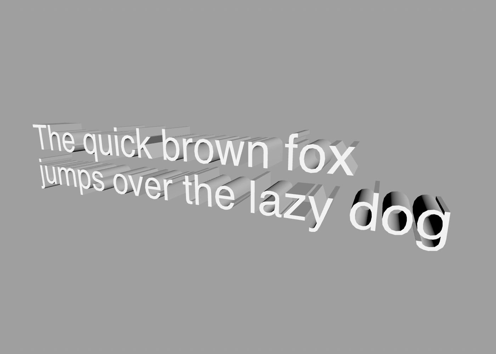
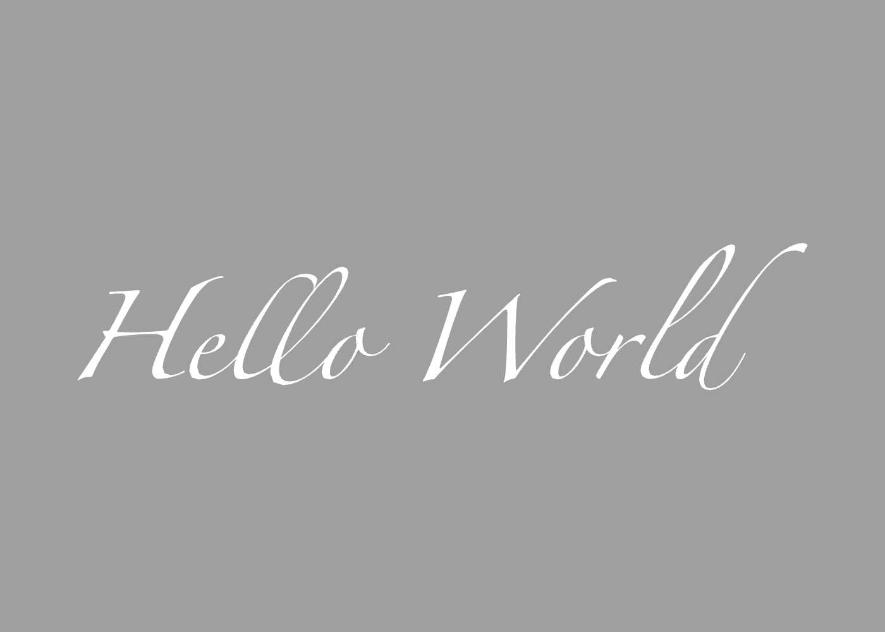

Text
---

The `text` command can be used to generate individual words, lines, or whole paragraphs of text. You use the `text` command as follows:

```swift
text "Hello World"
```

To create multiline text you can use the "\n" line-break sequence:

```swift
text "The quick brown fox\njumps over the lazy dog"
```

Or place each line of text on its own line within the file, surrounded by quotes:

```swift
text {
    "The quick brown fox"
    "jumps over the lazy dog"
}
```

The output of the `text` command is a series of [paths](paths.md), one for each character or *glyph* in the text:


You can use the `fill` or `extrude` commands to turn these paths into a solid mesh (see [builders](builders.md) for details):



To adjust the text font, you can use the `font` command. like `color` and other [material](materials.md) properties, `font` can be placed either inside the `text` block, or before it in the same scope:

```swift
font "Zapfino"
fill text "Hello World"
```



**Note:** Some fonts are inherently much more detailed than others, and may take a considerable time to generate. You may need to set the [detail](options.md#detail) option to a lower value for text than you would for other geometry.

---
[Index](index.md) | Next: [Builders](builders.md)
