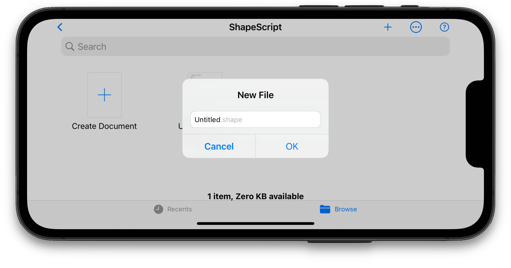
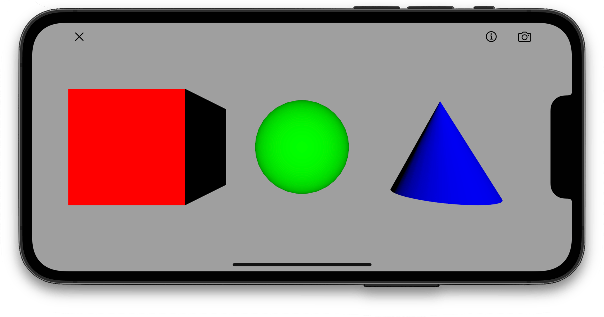
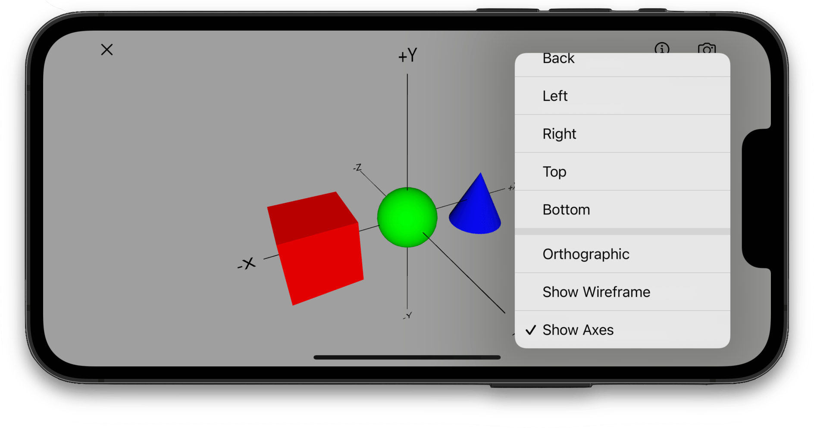
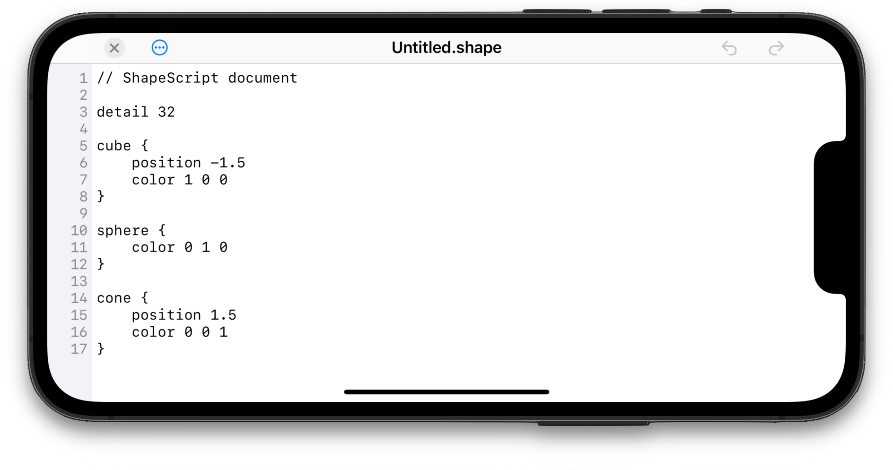
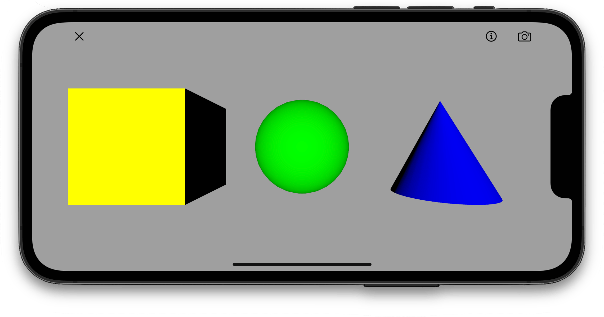
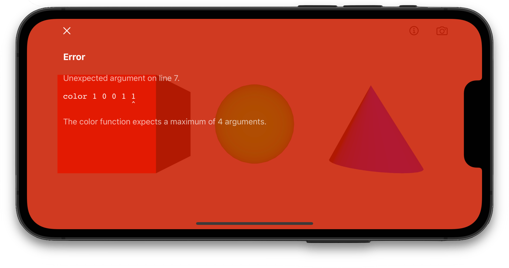

Getting Started
---

ShapeScript Viewer for iOS is designed for opening and exploring 3D models and scenes that use the ShapeScript `.shape` file format.

If you do not have any existing ShapeScript files, you can create one using the `+` button. You will be prompted to select a name and location for your new file - you can call it anything you want, but be sure to retain the `.shape` file extension.



After pressing OK you should see a new screen appear containing a cube, sphere and cone. These are the default contents for a new file (don't worry, you can replace them with your own shapes).



## Viewing

Drag your finger inside the window and you will notice that the three objects appear to rotate.

You are not actually moving the objects themselves, but rotating the camera around them. To return to the original orientaton, tap the camera icon in the top-right and select `Reset View`.

To help you orient yourself, you can enable the `Show Axes` option in the camera menu, which displays the direction of the X, Y and Z axes.



For more information about navigating around the model, see [Camera Control](camera-control.md).

## Editing

ShapeScript Viewer does not include an editor. To edit your `.shape` file you will need to open your `.shape` file in a separate text editor such as [Subtext](https://apps.apple.com/app/subtext/id1606625287) or [Runestone](https://apps.apple.com/app/runestone-text-editor/id1548193893).

Once opened, the file should look something like this:



ShapeScript files are just ordinary text documents, so they can be opened in any program that supports editing text. Subtext is free, but does not support syntax coloring or some of the other programmer-friendly features of more advanced editors.

No third-party editors currently support ShapeScript syntax directly, but if you set your editor to treat `.shape` files as another C-like language (e.g. C, Swift or Java) then it should do an acceptable job of syntax coloring and indenting. Some editors (such as Runestone) will make this association automatically, which will save you having to do it each time you edit a ShapeScript file.

If you are using an iPad, you can use the [Split View](https://support.apple.com/en-gb/guide/ipad/ipad08c9970c/ipados) feature to show both ShapeScript Viewer and your text editor on screen simultaneously:


**Note:** Not all iOS text editors support *live editing* (where changes in the text are reflected automatically in ShapeScript as you make them). You may find you have to explicitly save or close the document in your editor for changes to take effect.

## File Structure

The first line of the default `.shape` document looks like this:

```swift
// ShapeScript document
```

Lines beginning with `//` are comments, and are ignored by the parser. You can use these comments to document what the different parts of your file are doing.

The next line is:

```swift
detail 32
```

This controls the level of detail used for shapes in the file. ShapeScript models are made out of triangles, so it is not possible for curved edges to be represented exactly. When you define a sphere or other curved shape, the `detail` value is used to decide how many triangles will be used.

Next we have the following:

```swift
cube {
    position -1.5
    color 1 0 0
}
```

These three lines (ignoring the closing `}`) represent three distinct instructions, although they are grouped together because they all relate to a single shape. White space (such as spaces, tabs, or blank lines) is mostly ignored, however each new instruction must be placed on a new line.

The first instruction, `cube`, creates the cube shape. Note the `{ ... }` braces after `cube`. Content inside braces relates to the instruction that precedes them. In this case, the braces contain instructions that set the  `position` and  `color` of the cube.

The line `position -1.5` means "position the shape 1.5 spacial units to the left of the origin". The *origin* is the center of the world, and is the default position at which new shapes will appear.

**Note:** The spacial units ShapeScript uses are arbitrary, and can represent anything that you wish them to: a centimeter, a meter, an inch, a mile, etc. Try to choose an appropriate scale for your models so that you avoid having to work with very large scales (thousands of units), or very small scales (thousandths of a unit). That will help to avoid rendering precision issues, as well as making your scripts easier to work with.

The `position` keyword is followed by up to 3 numbers representing offsets along the X, Y, and Z axes respectively. If values are omitted, they are assume to be zero, so a position o-f `-1.5` is equivalent to `-1.5 0 0`. This is covered in detail in the [transforms](transforms.md#position) section.

The next line, `color 1 0 0` sets the current color. The three numbers after the keyword represent the red, green, and blue color channels, each with a range from 0 to 1. Because the red channel is 1 and the other channels are 0, the resultant color will be pure red.

As with `position`, you can omit values for the `color`, but the behavior is slightly different: If you only specify one value then that will be used for all three color channels. You can optionally specify a fourth "alpha" value to control transparency. This is covered in detail in the [materials](materials.md#color) section.

The groups of instructions after the cube are similar, but define a sphere and cone respectively.

## Next Steps

Change the `color 1 0 0` instruction to `color 1 1 0`, and then save the file. If you switch back to the ShapeScript app you should now see that the red cube has changed to yellow. ShapeScript tracks changes to any open files and will automatically update the view whenever they are saved.



Try tweaking the values for the `position`  and `color` instructions and observing the effects. You could also try adding a `size` option, which works like the others, but controls the *size* of the shape.

If you make a mistake, you will see a screen like this:



There is no cause for alarm if you see this screen. Just fix your mistake and save again to clear the error. If you aren't sure what you did, and the error message doesn't help, use undo feature in your editor to backtrack to a working state and try again.

When you are comfortable with manipulating the default shapes, try deleting them and adding new ones of your own.

**Note:** Many text editors save automatically every few seconds, so you may find that ShapeScript applies your changes as you type, even if you haven't explicitly saved. If you are in the middle of typing a new command when the automatic refresh takes place, ShapeScript may display an error, just as if you had manually saved an incomplete file. Errors that appear while you are still typing can be safely ignored.

## Debugging and Selection

You can get information about your model (such as polygon count and overall dimensions) by tapping the info icon in the top-right corder of the screen.

If a particular part of your model doesn't look right, you can tap to select it in the viewer, then get info on just the selected part. This will also tell you which line in the script file defines that component.


---
[Index](index.md) | Next: [Camera Control](camera-control.md)
