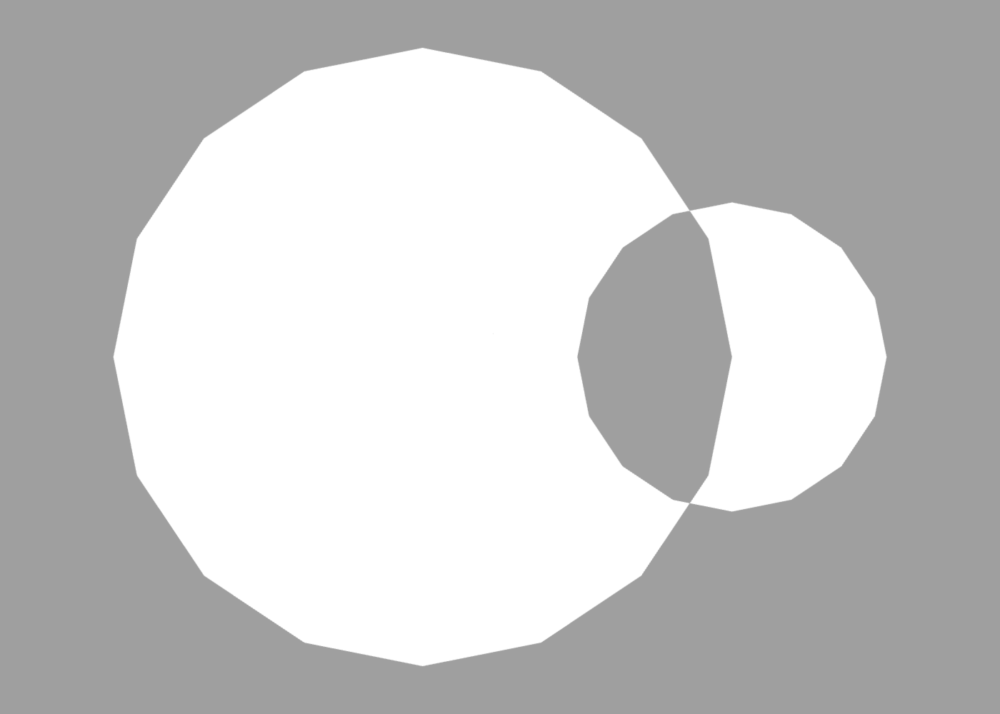
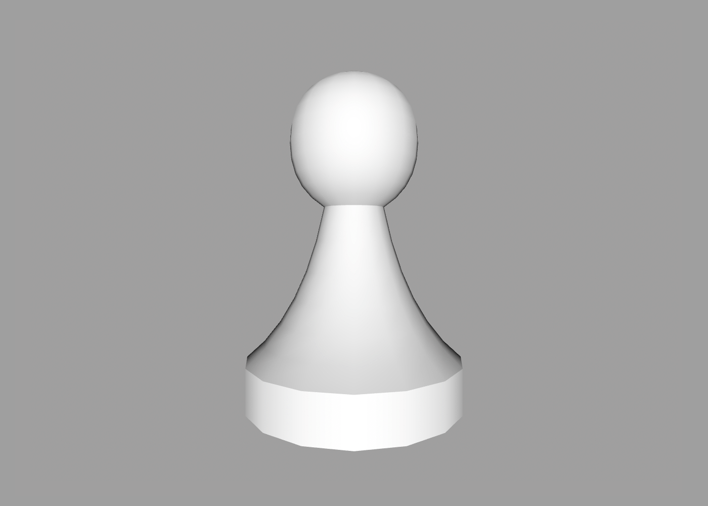
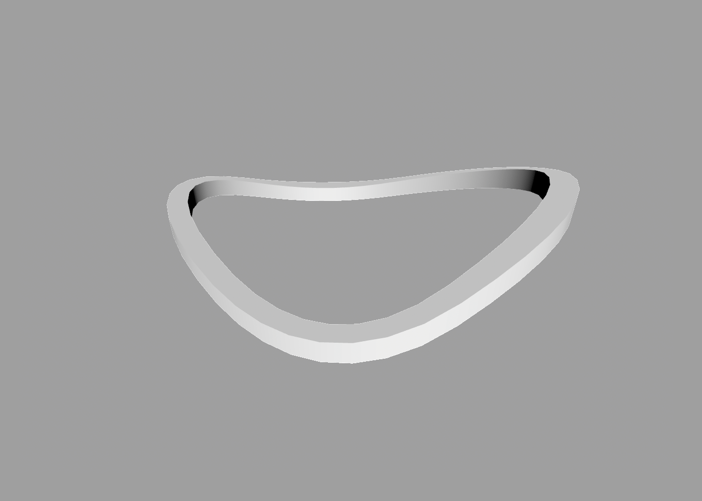
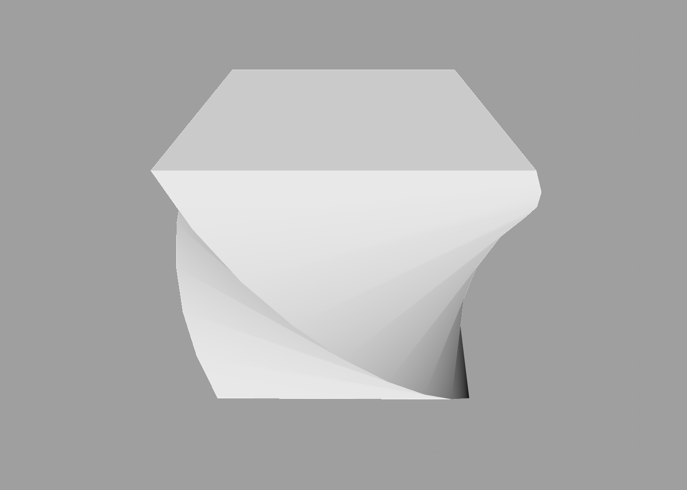
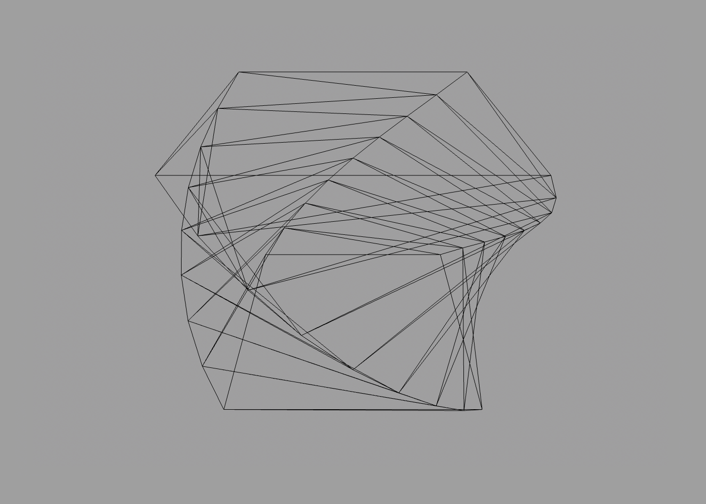
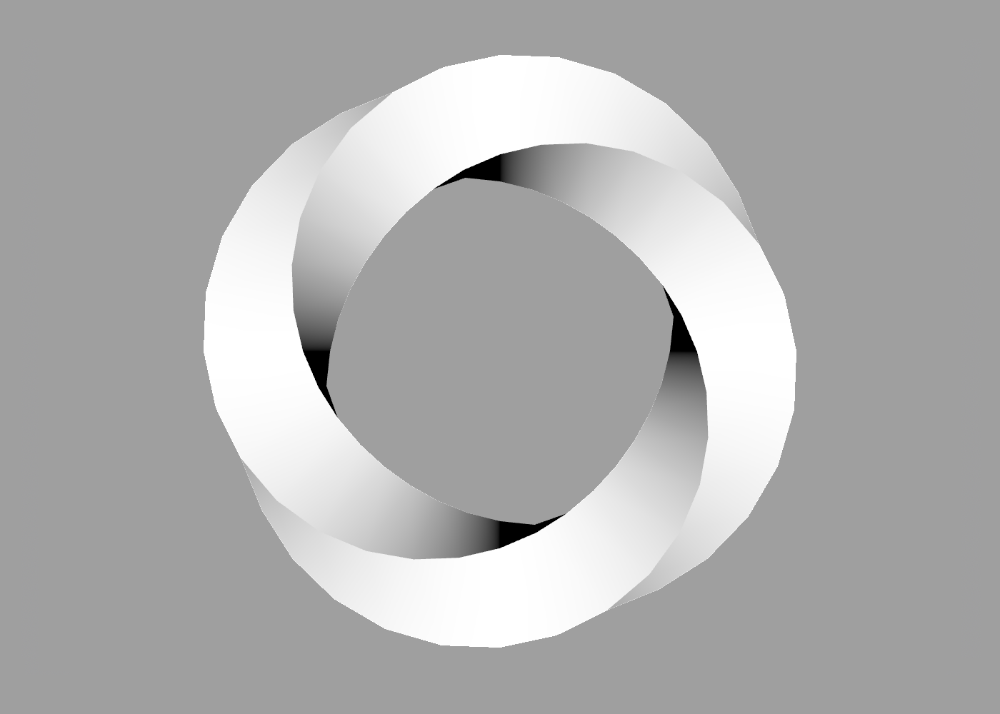
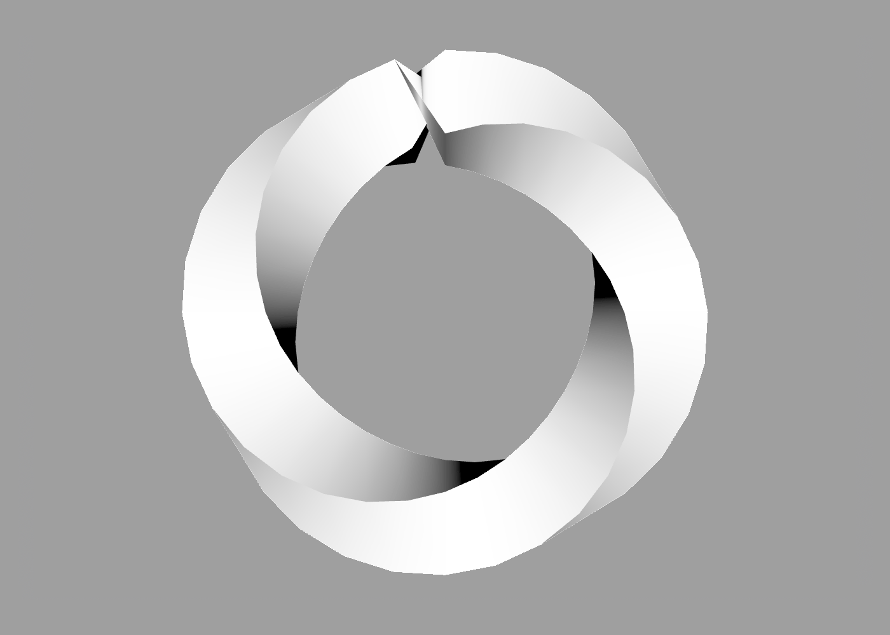
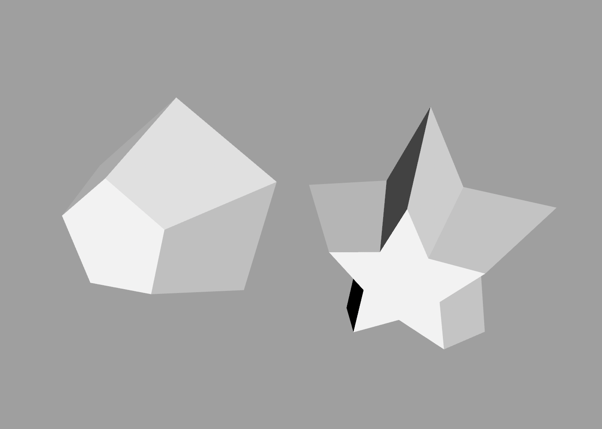
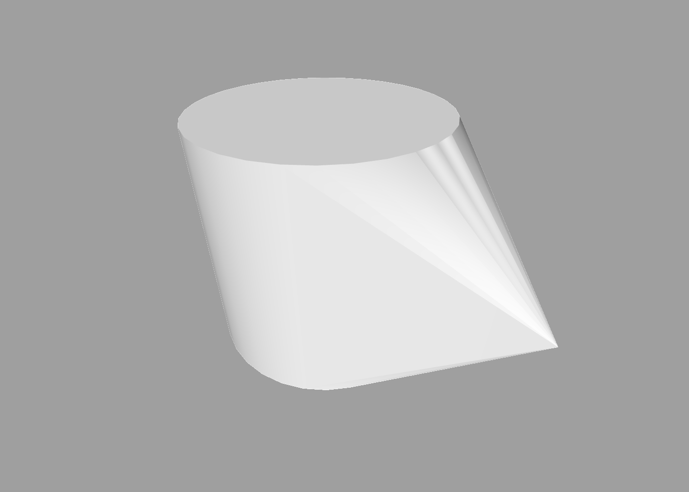
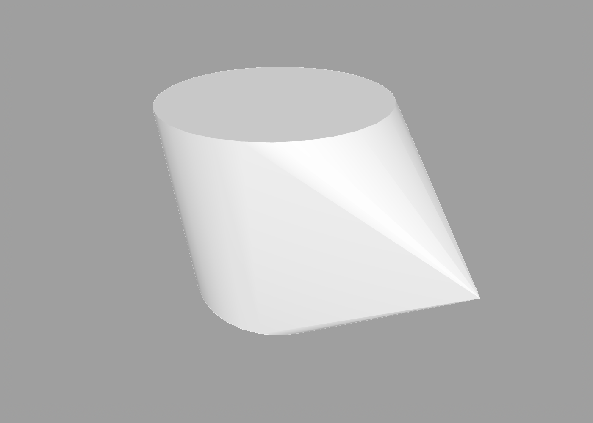

Builders
---

We explored some basic 3D shape types in the [primitives](primitives.md) section, but the real power of ShapeScript comes from the ability to define custom shapes.

In the [paths](paths.md) section we looked at how to define custom shapes using paths. ShapeScript has a variety of built-in commands for creating 3D shapes from paths, called *builders*:

## Fill

The most basic shape builder is the `fill` command, which creates a filled polygon from a path. Using the pentagon path we defined earlier, we can use `fill` to create a solid pentagon:

```
fill path {
    for 0 to 5 {
        point 0 1
        rotate 2 / 5
    }   
}
```


Unlike a path, a filled shape can have a color and texture, but it has zero thickness.

If a path contains multiple overlapping sub-paths, they will be filled using the [even-odd rule](https://en.wikipedia.org/wiki/Even–odd_rule). For example, the [overlapping circles](paths.md#nested-paths) path would be filled like this:

```swift
fill path {
    circle
    translate 0.5
    scale 0.5
    circle
}
```



## Lathe

The `lathe` command creates a 3D shape from a 2D path by revolving it around the Y axis.

To use `lathe`, you must first define a suitable path. For example, the following code defines the *profile* (one half of the outline) of a chess piece:

```swift
path {
    curve 0 0.78
    curve -0.15 0.7
    curve -0.15 0.5
    point -0.07 0.45
    curve -0.12 0.2
    point -0.25 0.1
    point -0.25 0
    point 0 0
}
```


When passed to the `lathe` command, the path creates a solid 3D model:

```swift
lathe path {
    curve 0 0.78
    curve -0.15 0.7
    curve -0.15 0.5
    point -0.07 0.45
    curve -0.12 0.2
    point -0.25 0.1
    point -0.25 0
    point 0 0
}
```



As with other curved shapes such as the `sphere` and `cone`, the smoothness of the lathed surface can be controlled using the `detail` and `smoothing` commands.

The path describing the profile of the lathed shape was in this case open-ended. Since the ends meet at the Y axis anyway, the resultant shape will still be closed. Open paths that do not touch the axis will produce a hollow shape with visible holes.

Lathed paths must lie flat on the XY plane, and  be positioned entirely to one side of the Y axis. Any points on the path with a non-zero Z coordinate will be flattened, and parts of the path that cross the Y axis will be clipped before lathing.

## Extrude

The `extrude` command extrudes a 2D path along the Z axis. The path therefore represents a cross-section of the final shape. The default extrusion distance is 1 unit, but it can be overridden using the `size` option or relative `scale` command (as described in [transforms](transforms.md)).

In the following example, `extrude` is used to create a triangular prism:

```swift
extrude {
    size 1 1 2 // increase extrusion distance to 2 units
    path {
        for 0 to 3 {
            point 0 1
            rotate 2 / 3
        }
    }
}
```


You can also extrude a shape *along* another path using the `along` option. In the following example, a circle is extruded along a rounded rectangle:

```swift
extrude {
    circle
    along roundrect {
        size 5
    }
}
```


In the following example, we extrude a square cross-section along a 3D path:

```swift
define shape path {
    orientation 0 0 -0.4
    curve 0 1 0.75
    curve -1 0
    curve 0 -1 0.25
    curve 1 0
    curve 1 1
    curve 0 1 0.75
}

extrude {
    square { size 0.1 }
    along shape
}
```


Note how the cross-section tilts as it follows the path. This can be a nice effect, but you might prefer that the cross section remains perpendicular to the world axes. To control this, you can use the `axisAligned` property:

```swift
extrude {
    square { size 0.1 }
    along shape
    axisAligned true
}
```



A value of `true` for `axisAligned` means the cross section will remain perpendicular to the path, which in some cases may cause the shape to look "pinched".

A value of `false` means the cross-section is always aligned to the tangent of the path, which ensures consistent thickness at the cost of inconsistent orientation.

If the `axisAligned` property is omitted, ShapeScript will try to choose an appropriate alignment for the path provided to `along`.

To apply a twist along the length of an extruded shape, you can use the `twist` property:

```swift
extrude {
    square
    twist 0.5
}
```



Twist uses the same [half-turn](transforms.md#orientation) units as the other rotation commands, so a twist of 0.5 equates to one quarter turn, or 90 degrees.

Applying a twist will automatically increase the number of cross sections in proportion to the current [detail](options.md#detail) level to prevent distortion:



You can combine `twist` with the `along` property to twist a curved path:

```swift
extrude {
    square { size 0.2 }
    along circle
    twist 2
}
```



**Note:** when extruding along a closed path, you should always use a multiple of `2` (i.e. a full rotation) for the `twist` value to avoid an ugly seam:




## Loft

The `loft` command is similar to `extrude`, but instead of taking a single cross-section path and extruding it by a fixed distance, `loft` accepts multiple cross-sections and then joins them together to form a solid shape.

For `loft` to work correctly, the specified paths must *not* all be located on the same plane, otherwise the resultant shape will be flat. You can either provide non-zero Z values for your path points, or use the `translate` command to space out your paths.

For example, the following code produces a prism equivalent to the extrusion example above:

```swift
loft {
    // triangle 1
    path {
        for 0 to 3 {
            point 0 1
            rotate 2 / 3
        }
    }

    translate 0 0 2

    // triangle 2
    path {
        for 0 to 3 {
            point 0 1
            rotate 2 / 3
        }
    }
}
```

You can also apply rotations and scaling between cross sections, to create bends or curves. For example, the following code creates a torus:

```swift
define steps 32
define radius 1 // radius of ring

loft {
    for 0 to steps {
        circle { size 0.25 }
        rotate 0 0 -1/steps
        translate 0 0 (2 * pi * radius / steps)
        rotate 0 0 -1/steps
    }
}
```


However, the real power of the `loft` command comes from the fact that you can use *different* cross-sections, and the resultant surface will be interpolated between them. For example, here is a shape whose cross-section is square at one end and circular at the other:

```swift
loft {
    square
    translate 0 0 1
    circle
}
```


## Hull

The `hull` command works a bit like `loft`, in that it joins together multiple paths to form a solid surface. Here is the `loft` shape above, implemented using `hull`:

```swift
hull {
    square
    translate 0 0 1
    circle
}
```


So if `hull` and `loft` are the same, why have a separate command?

The difference is that rather than joining sections together in a tube, `hull` forms a tight *skin* around the outside of all its child shapes, known as a [convex hull](https://en.wikipedia.org/wiki/Convex_hull). To illustrate the difference, here is the `hull` of a star shape, vs a `loft` of the same shape:



But the real power of the `hull` command is that it's not limited to operating on paths. Unlike the other builders, you can create a hull around meshes, paths, points, or any combination. For example, here is a hull formed from a cylinder and a point:

```swift
hull {
    cylinder
    point 1 0 0
}
```



This allows for a lot of interesting shapes that would be hard to create using the other commands.

You might notice some odd stripes on the surface near the lip of the cylinder. As you may recall from the [detail](options.md#detail) section, curved surfaces in ShapeScript are actually formed from straight-edged polygons, with lighting used to make them appear smooth.

When creating a hull from different shapes, the resultant [surface normals](https://en.wikipedia.org/wiki/Normal_(geometry)) aren't always what you'd expect, which can result in lighting glitches like this. In some cases you can use the [smoothing](options.md#smoothing) command to smooth out these discrepancies, like so:

```swift
smoothing 0.25
```



---
[Index](index.md) | Next: [Constructive Solid Geometry](csg.md)
