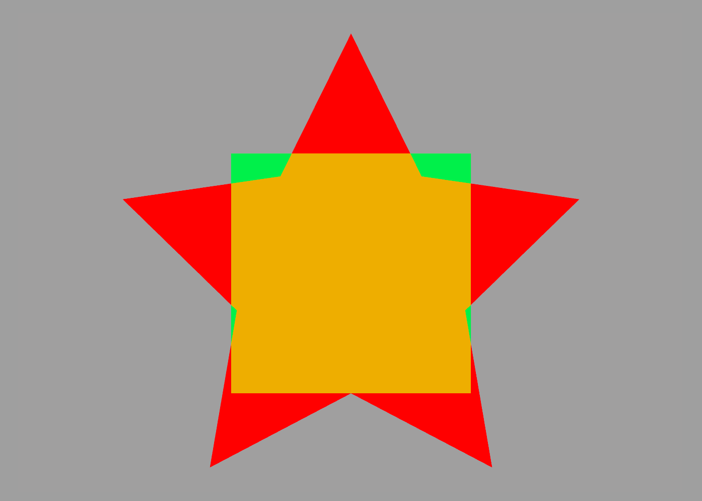
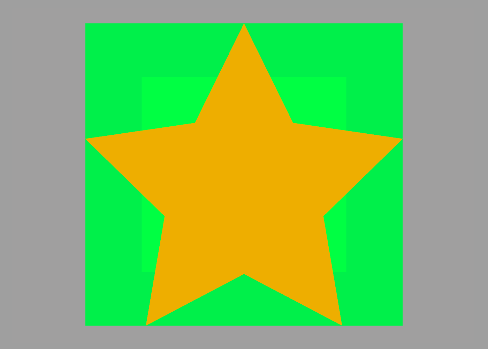

Bounds
---

ShapeScript's [size](transforms.md) ands [scale](transforms.md) commands let you control the relative size of a shape, but sometimes it's useful to know the exact dimensions.

A cube of size 1 has an easily-predicted size of one world unit square, but what about a more complex shape, such as a 5-pointed star (see the [procedural paths](paths.md) and [blocks](blocks.md) sections for details):

```swift
define star path {
    for 1 to 5 {
        point 0 -0.5
        rotate 1 / 5
        point 0 -1
        rotate 1 / 5
    }
    point 0 -0.5
}

// draw star
extrude {
    color red
    star
}

// draw cube
cube {
    color green 0.5
}
```



We can see that the star is larger than the unit cube, but other than trial-and-error or complex math, how can we get the exact size? This is where the `bounds` [member property](expressions.md) comes in.

## Mesh Bounds

Paths and meshes both expose a `bounds` property that represents a bounding box around the shape. From this you can get the exact size and position needs to place a box around the star:

```swift
define star {
    ...
}

// define star shape
define shape extrude {
    color red
    star
}

// draw star
shape

// draw box around star
cube {
    color green 0.5
    position shape.bounds.center
    size shape.bounds.size
}
```



## Path Bounds

In the example above we computed the bounds of a solid `mesh` (an extruded star-shaped `path`) but you can also get the bounds of a `path` directly. The following code draws the star path inside its bounding rectangle:

```swift
define star {
    ...
}

// draw star
star

// draw rectangle around star
square {
    position shape.bounds.center
    size shape.bounds.size   
}
```


## Bounds Members

The `bounds` member property has the following sub-properties that you can use:

* `min` - The position of the corner of the box with the smallest X, Y and Z values relative to the origin. 
* `max` - The position of the corner of the box with the largest X, Y and Z values relative to the origin.
* `center` - The position of the center of the box relative to the origin.
* `size` - The size (width, height and depth) of the box in world units.
* `width` - The width of the box along the X axis (equivalent to `size.width`)
* `height` - The height of the box along the Y axis (equivalent to `size.height`)
* `depth` - The depth of the box along the Z axis (equivalent to `size.depth`)

So, for example, to get the height of a shape, you could use:

```swift
print someShape.bounds.size.height
```

or just:

```swift
print someShape.bounds.height
```

And to get the X coordinate of its rightmost edge you could use:

```swift
print someShape.bounds.max.x
```

---
[Index](index.md) | Next: [Groups](groups.md)
