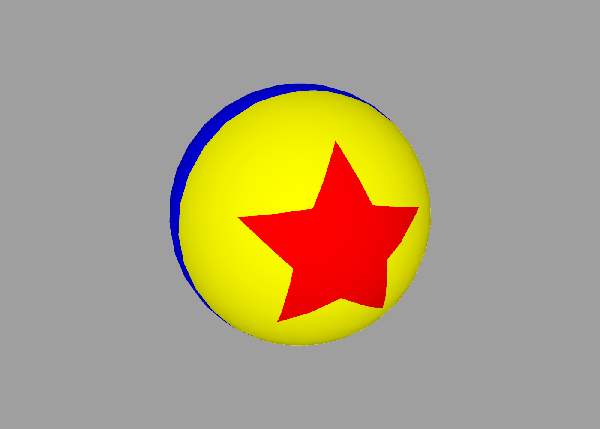
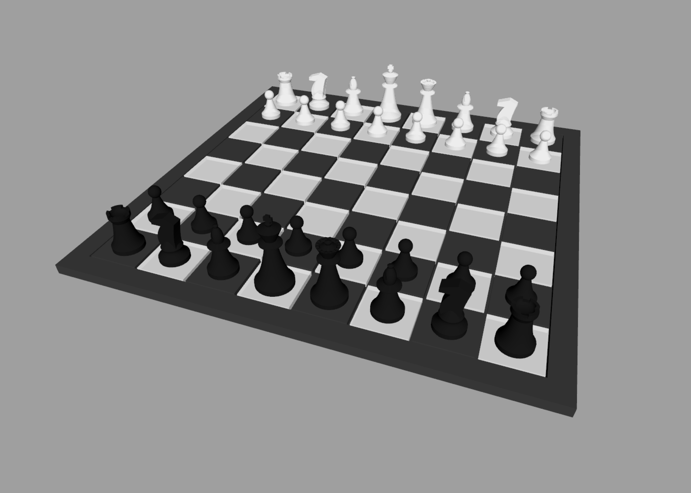
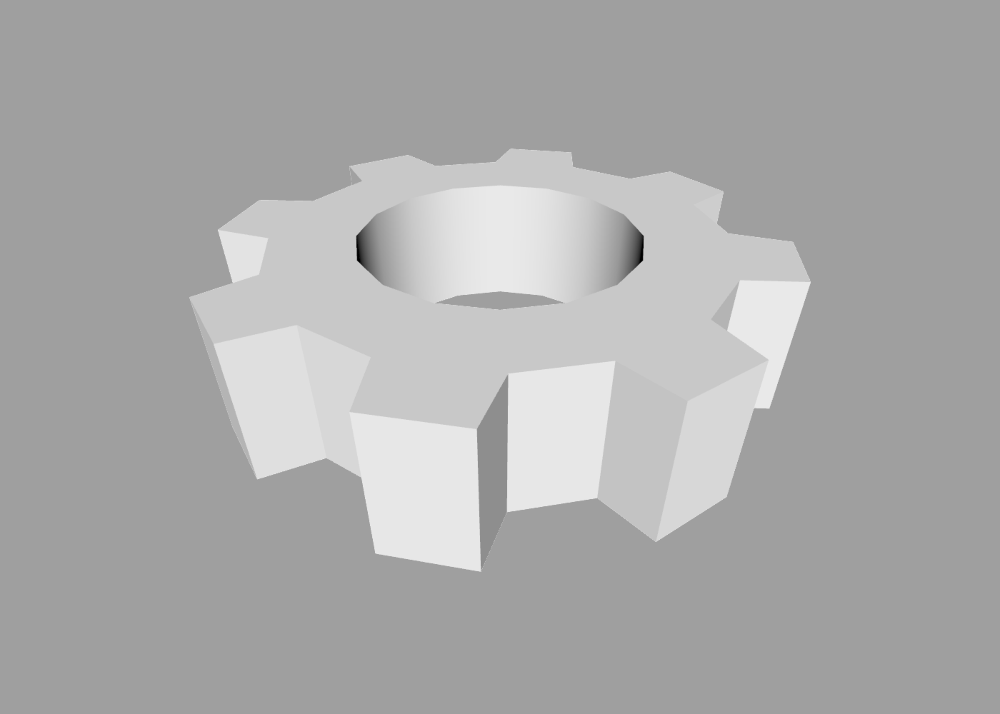

Examples
---

ShapeScript includes a number of example files that demonstrate various features. You can find these under the `Help > Examples` menu.

## Ball

The Ball example demonstrates how to use the [stencil](csg.md#stencil) command to "paint" patterns on a sphere, as well as a [for loop](control-flow.md#loops) to generate a star shape that is then [extruded](builders.md#extrude).

## Chessboard

The Chessboard example demonstrates the use of [for loops](control-flow.md#loops) to duplicate shapes, along with [paths](paths.md), [lathe builders](builders.md#lathe) and [CSG](csg.md) operations.

## Cog

The Cog example demonstrates procedural generation of a complex [path](paths.md) using a [for loop](control-flow.md#loops), as well as the creation of a custom [block](blocks.md) and the use of the [option](blocks.md#options) command to pass parameters.

## Earth

The Earth example demonstrates use of the [texture](materials.md#texture) command to turn a simple sphere into a model of the globe.

## Spirals

The Spirals example demonstrates using the [extrude](builders.md#extrude) command to create a spiral. This example also demonstrates the use of [for loops](control-flow.md#loops) and user-defined [options](blocks.md#options).

## Spring

The Spring example demonstrates how to use the [loft](builders.md#loft) command and a [for loop](control-flow.md#loops) to create a coiled spring shape. 

## Train

The Train demonstrates a combination of modeling techniques, including using the [rnd](commands.md#random-numbers) command to generate pseudo-random coal.

---
[Index](index.md) | Next: [Glossary](glossary.md)
