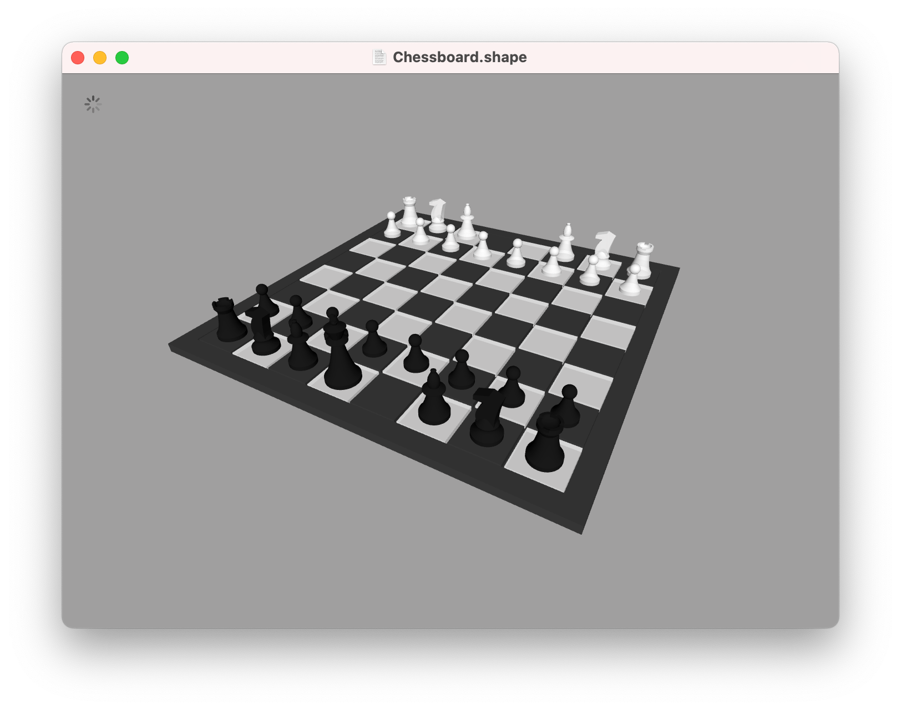

Export
---

Once you've finished crafting your 3D model, you'll probably want to *do something* with it. For that you will need to use the *Export* feature.

**Export is a paid upgrade that can be unlocked via in-app purchase in the [ShapeScript Mac App](https://apps.apple.com/app/id1441135869). Export is not available in the free ShapesScript Viewer for Mac and iOS.**

To export your model, select the `File > Purchase Export Feature…`  menu (**Cmd-Shift-E**) to unlock the export functionality. Once unlocked, this menu will change to `Export…`.

**Note:** If the `Export…` menu is grayed-out, it is most likely because your model is still loading. Wait for the loading spinner in the top-left of the ShapeScript document window to finish before trying to export.

ShapeScript can export your model in a variety of formats, selectable from the export window:

Extension             | File Type                                        | Supports All Features
:-------------------- | :------------------------------------------------|:------------------------------
abc                   | Alembic                                          | No 
dae                   | Collada DAE                                      | Yes
obj                   | Wavefront Object                                 | No
scn / scnz            | SceneKit Scene Document                          | Yes
usd / usdz            | Universal Scene Description                      | No
ply                   | Polygon File Format                              | No
stl                   | Stereolithography                                | No

 

**Note:** Not all formats support all features of ShapeScript models, so you may need to experiment. In general, DAE is the most reliable, widely-supported format to use.

Some model formats do not support embedding geometry and textures or materials in a single file; In this case, ShapeScript will export a folder containing the model and associated assets as separate files.

Exported models can be used in a variety of ways:

## 3D Games and Augmented Reality

ShapeScript models are well-suited to use in realtime 3D because the `detail` command gives you fine control over the triangle count. For realtime use you should generally set the detail level as low as you can get away with.

You can import DAE files into a game development tool like Unity, or use SCN(Z) files with Apple's SceneKit and ARKit frameworks in Xcode.

## 3D Printing

ShapeScript can export models in STL format, used by many 3D printing applications. Just use `stl` as the file extension when exporting your model for printing. 

When exporting for 3D printing, you will usually want to avoid having internal geometry inside the outer surface of your model. A good way to do this is to use the [union](csg.md#union) command to combine all the parts of your model into a single shape, eliminating internal faces.

ShapeScript uses the "Y-up" convention, where the Y-axis points up and the Z-axis points out from the screen. Some popular 3D printing applications such as [Cura](https://ultimaker.com/software/ultimaker-cura) use the "Z-up" convention instead. Check the "Convert to Z-Up" option in the ShapeScript preferences to export models in this orientation.

## Rendering an Image

In addition to 3D model formats, ShapeScript can also export 2D images. By default, images will be captured using the current camera, but you can select a different [camera view](cameras.md) from the export window. 

The following image formats are supported:

Extension             | File Type                                         | Supports Transparency
:---------------------| :-------------------------------------------------|:------------------------------
gif                   | Graphics Interchange Format                       | Yes
png                   | Portable Network Graphics                         | Yes
jpg / jpeg            | Joint Photographic Experts Group                  | No
jpf / jp2             | JPEG 2000                                         | Yes
tif / tiff            | Tagged Image File Format                          | Yes 
bmp                   | Bitmap                                            | No

 

If you aren't sure which format to use, the PNG format is a good all-rounder, with lossless compression and transparency support.

The size of the exported image defaults to the current window size and display resolution. You can override this size by adding `width` and/or `height` options to your [custom camera](cameras.md#pixel-dimensions):

Images are exported with a transparent background by default if the selected format supports it, or white otherwise. To change the background color or set a background image, you can use the [background command](commands.md#background).

When exporting an image (or exporting a model for non-realtime use), you may wish to use the `detail` command to increase the detail level. A detail level of 100 should be good enough for even a very large or high-resolution image, but this may take a long time to generate for a complex model.

**Note:** Although ShapeScript can export images, for best results you should export as a 3D model and then import that into a ray tracing program that provides fine-grained control over scene lighting and camera placement.

---
[Index](index.md) | Next: [Examples](examples.md)
