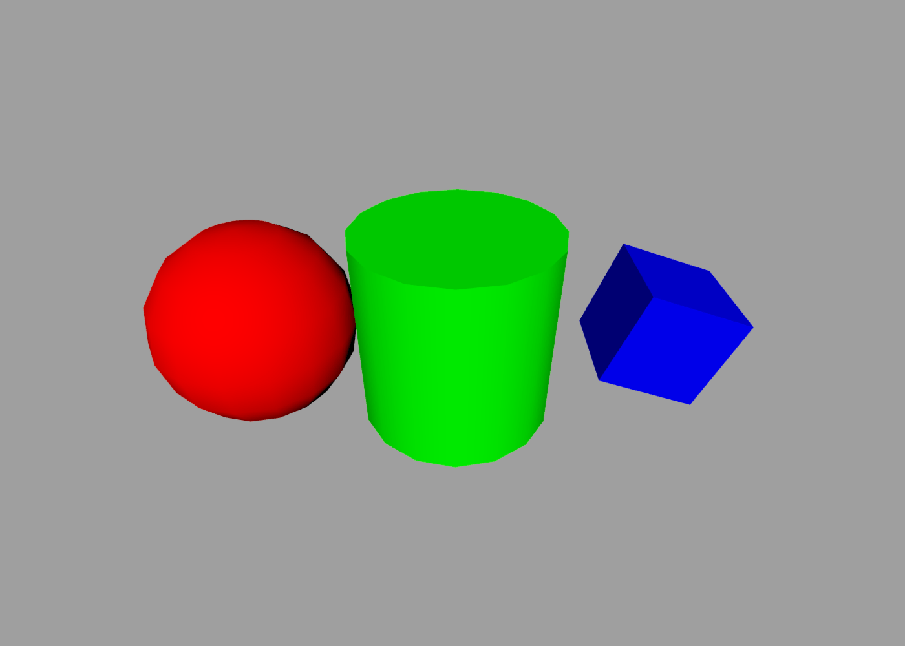

Groups
---

Complex 3D shapes often follow a natural hierarchy - a car has wheels, or a torso has arms and legs. You can create a hierarchy in ShapeScript by using the `group` command:

```swift
group {
    position -0.5 0 0
    sphere {
        position 0 0 0
    }
    cylinder {
        position 1 0 0
    }
}
```

Like other 3D shapes, a group has a `position` and `orientation` in 3D space, but it can also contain child shapes which inherit its coordinate system; if you move the group, its children move with it. The `position`, `orientation` and `size` properties of the children will be treated as relative to those of the containing group.

You can override the current [material](materials.md) at any point inside a group and only the subsequent children will be affected. You can also use [relative transform](transforms.md) commands to manipulate the relative transforms for shapes inside the group:

```swift
group {
    color 1 0 0
    sphere
    translate 1
    color 0 1 0
    cylinder
    translate 1
    rotate 0.1
    scale 0.5
    color 0 0 1
    cube
}
```



Changes made to the transform or material are [scoped](scope.md) to the group, and will not carry beyond the closing `}`.

---
[Index](index.md) | Next: [Paths](paths.md)
